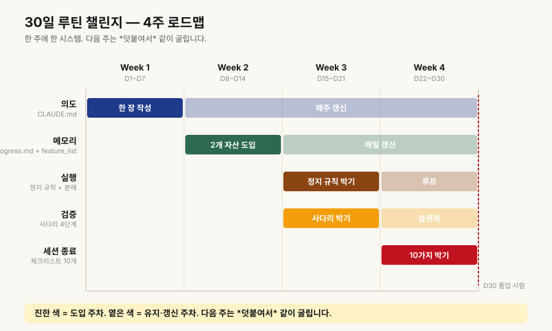

# 캡스톤. 내 첫 30일 루틴 챌린지

> **"읽기는 끝났습니다. 이제 *내 루틴 하나*를 골라 30일 동안 에이전트에게 옮깁니다. 끝나면, 당신은 *지속 가능한 자동화* 한 개를 가진 사람이 됩니다."**

## 여기까지 읽었다면, 시리즈의 절반은 끝났습니다

여기까지 오신 것만으로도 박수를 보냅니다. 챕터 1부터 12까지, 하네스의 다섯 개 방을 한 번씩 둘러보셨습니다.

그런데 솔직히 말씀드리면, 글로 읽은 것은 *시리즈의 절반*에 불과합니다.

나머지 절반은 책상이 아니라 **30일의 실전**에 있습니다. 손이 익을 때까지, 사고가 한두 번 터질 때까지, *내 루틴 하나*가 에이전트의 손에 옮겨갈 때까지. 그래서 캡스톤은 강의가 아니라 *졸업 작품*입니다. 한 달 뒤, 당신은 "AI에 대해 아는 사람"이 아니라 **지속 가능한 자동화 한 개를 가진 사람**이 됩니다.

## 챌린지가 정확히 무엇인가요

이 챌린지는 새 SaaS를 만드는 게 아닙니다. 멋진 데모를 찍는 것도 아닙니다.

> **지금 내 일상에서 반복되는 루틴 한 개를 골라, 30일 동안 에이전트에게 옮기는 것.**

조건은 단순합니다. *이미 내 손으로 매주 하고 있는 일* 중에서 고릅니다. 처음 하는 일이 아니라, 손에 익은 일입니다. 작게 시작합니다. 30분이면 끝나는 주간 작업 하나면 충분합니다.

크게 시작한 사람은 보통 2주차에 무너집니다. *내 손이 이미 아는 일* 하나를 30일 동안 에이전트에게 가르치는 것 — 그게 이 캡스톤의 전부입니다.

## 어떤 루틴을 고를까요 — 후보 7개

운영자가 실제로 굴려본, 그리고 100 Agents 팀에서 직접 본 후보 7개입니다. 본인 페르소나에 가까운 한 줄을 고르세요.

- **매주 월요일 — 주간 회의록 요약 + 이슈 카드 자동 생성** (PM)
- **매일 아침 — 어제 분석/모니터링 요약을 슬랙 한 줄로** (PM/창업자)
- **매주 화·금 — 블로그 글 초안 + 발행 큐 적재** (마케터)
- **매일 — 고객 문의 트리아지 + 1차 응답 초안** (창업자)
- **매주 — 경쟁사 신규 기능 모니터링 요약** (PM)
- **매주 — 사용자 행동 데이터에서 뽑은 5줄 보고서** (PM)
- **매주 — 다음 주 콘텐츠 캘린더 자동 생성** (마케터)

7개 중 *지금 머릿속에서 가장 또렷한 한 개*를 고르세요. 망설여진다면 *가장 자주 반복되는* 한 개입니다.

## 4주 로드맵 한 장

캡스톤은 4주, 즉 30일을 다음 네 단계로 나눕니다.

| 주차 | 목표 | 산출물 |
|---|---|---|
| 1주차 | 의도 정의 + 작업장 세팅 | `CLAUDE.md` 50줄, `intent_sheet.md` 1장 완성 |
| 2주차 | 첫 실행 + 검증 사다리 | `feature_list.json` 첫 항목 `passing` 도달 |
| 3주차 | 정지 규칙 + 관측 | 토큰·도구 호출 측정, 정지 규칙 1~2개 실제 발동 |
| 4주차 | 클린 종료 + 회고 | 세션 종료 체크리스트 매일 실행, 30일 회고 글 1편 |

<!-- DIAGRAM v1.1
  위치: capstone-30-day-routine-challenge.md:47
  제목: "30일 루틴 챌린지 — 4주 로드맵"
  설명: 4주 × 주간 목표 × 완료 체크박스
  형식: 간트(Gantt) 차트
  대체텍스트: 1주차 의도·2주차 실행·3주차 제약·4주차 종료의 4주 목표와 완료 체크박스가 표시된 간트 차트
-->

한 주가 *방 한 칸*입니다. 1주는 의도, 2주는 실행, 3주는 제약, 4주는 종료. 챕터 2에서 본 하네스의 다섯 개 방이 한 주씩 살아납니다.

## 주차별 일일 체크리스트

각 주차마다 5개 항목입니다. 매일이 아니라 *그 주가 끝나기 전까지* 다섯 개 다 체크하면 됩니다.

### 1주차 (의도) — "무엇을, 왜, 어디까지"

- [ ] 루틴 1개 선정 + `intent_sheet.md` 1장 작성 (의도/결과/제약/정지 규칙 모두)
- [ ] `CLAUDE.md` 50줄 작성 — 챕터 4의 5칸부터 채웁니다
- [ ] `feature_list.json`에 첫 3~5개 항목 등록 (verification 칸 비우지 말기)
- [ ] `progress.md` 매일 5칸 채우기 (오늘 한 일·막힘·내일 첫 작업·결정·다음 명령)
- [ ] 세션 시작 스니펫 1줄을 `progress.md` 맨 아래에 박기

### 2주차 (실행과 검증) — "진짜로 한 번 돌려보자"

- [ ] 1주차에 등록한 항목 중 1개를 `passing` 상태까지 끌고 가기
- [ ] `feature_list.json`의 모든 항목 `verification` 칸을 채우기 (빈 칸 금지)
- [ ] E2E 시나리오 1개를 *글로* 적기 ("나는 A를 누르고, B가 보이고, C를 받는다")
- [ ] 사람 1명 앞에서 *첫 시연* 1회 (가족·동료·친구 누구든)
- [ ] `feature_list.json`의 `state` 값이 *정직한가* 점검 ("동작함" 말고 "passing")

### 3주차 (제약과 관측) — "AI에게 브레이크를 달자"

- [ ] `intent_sheet.md`에 정지 규칙 2개를 *수치*로 박기 (토큰·시간·반복 횟수)
- [ ] 토큰 사용량을 매일 한 줄씩 `progress.md`에 기록
- [ ] 도구 호출(파일 읽기/쓰기/외부 호출)을 1회 점검 — 이상한 호출이 있는지
- [ ] `CLAUDE.md`의 "절대 하지 말 것"에 5개 이상의 하드 제약 박기
- [ ] 정지 규칙이 *실제로 1번 발동*하는 경험 (안 발동되면 한도를 너무 높게 잡은 것)

### 4주차 (클린 종료와 회고) — "내일의 나에게 넘기기"

- [ ] 매일 `session-end-checklist.md` 10개 항목 실행 (특히 키·로그 정리)
- [ ] 30일 회고 글 1편 작성 (1,000자 이상)
- [ ] 디스코드·디스콰이엇·X 중 한 곳에 1회 *공개 공유*
- [ ] 다음 30일 *유지 계획* 1장 (이 루틴을 어떻게 계속 굴릴지)
- [ ] 챕터 13(루틴 파일 리팩토링)로 자연스럽게 이동

## 챌린지 시작 키트 — 루틴팩 5종 한 줄 사용법

루틴팩 v1을 아직 안 받으셨다면, 지금이 받으실 때입니다. 5개 파일이 각각 챌린지의 한 자리를 차지합니다.

- **`CLAUDE.md`** — 프로젝트의 첫 페이지. 50줄. 매 세션의 시작.
- **`feature_list.json`** — 살아 있는 작업 5~10개의 뼈대. 상태는 항상 정직하게.
- **`progress.md`** — 매일 5칸. 어제와 오늘을 잇는 다리.
- **`intent_sheet.md`** — 의도·제약·정지 규칙·평가의 *한 장*.
- **`session-end-checklist.md`** — 매 세션 마지막 5분의 의식.

다섯 개를 다 쓰지 않으면 챌린지가 흔들립니다. 한두 개만 쓰면 *예전처럼 헤매는* 자리로 돌아갑니다. 5종은 *함께* 작동하도록 설계되었습니다.

## 흔히 막히는 6가지 지점과 처방

30일 동안 운영자도, 함께 굴린 빌더들도 거의 같은 자리에서 막혔습니다. 막힐 때마다 *그 챕터로 되돌아가세요*. 처음 읽을 때와 두 번째 읽을 때가 다릅니다.

| 막힌 지점 | 처방 챕터 |
|---|---|
| 매번 같은 설명을 새 창에서 반복하고 있다 | 챕터 4 — `CLAUDE.md` |
| 어제 한 일을 오늘 잊었다 | 챕터 5 — `progress.md` |
| 새 세션의 첫 명령이 안 떠오른다 | 챕터 6 — 5분 브리핑 |
| AI가 자꾸 일을 키운다 (scope creep) | 챕터 7 — 정지 규칙 |
| "다 됐어요"라는데 시연하면 깨진다 | 챕터 9 + 10 — 검증과 클릭 테스트 |
| 청구서가 갑자기 폭탄으로 온다 | 챕터 11 — 관측 가능성 |

여섯 개 중 본인이 *가장 자주 부딪힌 한 개*가 있을 겁니다. 그 챕터를 캡스톤 중간에 한 번 더 정독하세요.

## 30일 회고 글, 이 5개 질문으로 적으세요

4주차의 마지막 산출물은 *글 한 편*입니다. 길이는 1,000자면 충분합니다. 형식은 아래 5개 질문에 솔직하게 답하시는 것으로 갈음합니다.

1. **어떤 루틴을 골랐고, 왜 그것이었나요?** (시작점)
2. **30일 중 가장 빛났던 순간 1개**는 무엇이었나요? (성공)
3. **가장 무너졌던 순간 1개**와, 그때 어떤 처방을 적용했나요? (실패와 회복)
4. **청구서·시간·횟수 세 가지 숫자로 본 결과**는요? (관측)
5. **다음 30일에 유지·축소·확장 중 무엇을 할 것**인가요? (의사결정)

PM 출신 운영자의 팁 하나. 5번 질문에 "확장"이라고 적고 싶어지면, 일단 *유지*를 한 달 더 해보세요. 잘 굴러가는 자동화 한 개의 가치가, 새 자동화 두 개의 가치보다 큽니다.

## 마지막 의식 — 책상에서 끝내지 마세요

> **챌린지의 마지막 의식은 *공유*입니다.**

서랍 속에 회고 글을 묻어두지 마세요. 30일이 끝났다면, 1회는 사람들 앞에 꺼내야 합니다. 디스코드 빌더 채널, 디스콰이엇 메이커 모임, X(트위터) 어디든 좋습니다. *가장 자랑하고 싶은 한 줄 + 라이브 URL 또는 스크린샷 한 장.* 그 한 번의 공개가 다음 달의 *유지 동력*이 됩니다.

운영자도 매달 1회는 X에 올립니다. 글이 잘 쓰여서가 아니라, *그 의식이 다음 달의 나를 살리기* 때문입니다.

## 자가 점검 7문항 — 졸업 시험

30일이 다 지난 마지막 날, 이 7개에 답해보세요.

- [ ] 30일 동안 *매일* `progress.md`를 썼나요?
- [ ] `feature_list.json`의 `state` 값이 *정직한가요*? (실제 상태 = 적힌 상태)
- [ ] 정지 규칙이 *최소 1번* 실제로 발동했나요?
- [ ] 시연을 *사람 앞에서* 최소 1번 했나요?
- [ ] 청구서가 *예측 가능*해졌나요? (지난주 ±20% 안에 들어오나요)
- [ ] 30일 회고 글을 *공개 채널에 1회* 올렸나요?
- [ ] 다음 30일 *유지 계획*이 *한 장*에 정리되어 있나요?

7개 중 5개 이상 *예*라면, 당신은 졸업입니다. 다음은 챕터 13(리팩토링)입니다.

## 마무리 — 한 번에 한 피드백씩

마지막 글은 운영자가 가장 좋아하는 한 줄로 닫겠습니다.

> *"You can't delegate what you can't verify."* — Eugene Yan

> **"30일 후, 당신은 *루틴 한 개를 가진 사람*입니다. 이제 그 루틴이 *살아 있게* 만드는 일이 남았습니다."**

캡스톤이 끝났다면, 다음 글은 **챕터 13 — 한 달 후, 내 루틴 파일을 리팩토링하는 법**입니다. 한 달간 살이 붙은 `CLAUDE.md`와 `feature_list.json`을 *책상이 아니라 규칙 자체*에서 정돈하는 의식을, 운영자의 매월 1일 루틴 그대로 옮겨드립니다.

## 시리즈 전체 챕터 목차

여기까지 따라오신 지도를 마지막으로 한 번 펼쳐드립니다.

| 구간 | 번호 | 제목 |
|---|---|---|
| 0주차 | P-01 | AI에게 일 시킨다는 것 |
| 0주차 | P-02 | 1주차에 외울 15개 단어 |
| 0주차 | P-03 | 내 도구 스택 정하기 |
| 본 강의 | 01 | 왜 똑똑한 AI도 내 앱은 끝내지 못하는가 |
| 본 강의 | 02 | 하네스란, AI에게 일 시키는 작업장 차리기 |
| 본 강의 | 03 | 채팅창 말고 폴더가 기억하게 하라 |
| 본 강의 | 04 | CLAUDE.md 한 장으로 AI에게 우리 프로젝트 가르치기 |
| 본 강의 | 05 | AI는 어제 한 일을 잊는다 — 메모를 남겨라 |
| 본 강의 | 06 | 시작 전에 5분, AI에게 우리 프로젝트 브리핑 |
| 본 강의 | 07 | AI가 일 키우는 걸 막는 법 |
| 본 강의 | 08 | 할 일 한 장이 모든 것을 바꾼다 (feature_list) |
| 본 강의 | 09 | '됐어요'를 믿지 마라, 증거를 요구하라 |
| 본 강의 | 10 | 실제 사용자처럼 클릭해보는 자동 테스트 |
| 본 강의 | 11 | AI가 뭘 했는지 들여다보는 창문 (관측 가능성) |
| 본 강의 | 12 | 내일의 나를 위해 책상 정리하고 나가기 |
| 캡스톤 | C-01 | 내 첫 30일 루틴 챌린지 (현재 글) |
| 보너스 | 13 | 한 달 후, 내 루틴 파일을 리팩토링하는 법 |

---

**운영자 맥락**
- 이 캡스톤은 [routine-pack/](../routine-pack/) 5종을 실제 프로젝트에서 30일간 굴려보는 챌린지입니다.
- 결과물은 멋진 회고가 아니라 살아 있는 `CLAUDE.md`, 최신 `progress.md`, 정직한 `feature_list.json`, 그리고 검증 증거입니다.
- 외부 참고: [Eugene Yan, "How to Work and Compound with AI"](https://eugeneyan.com/writing/working-with-ai/).
