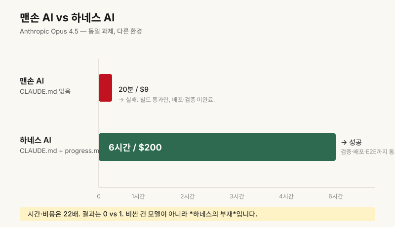

# 챕터 1. 똑똑한 AI가 끝까지 못 끝내는 이유

> **"Claude Code가 일을 끝까지 못 끝낸다면, 모델이 아니라 하네스(harness)가 문제입니다."**

## 새벽 3시, 또 갈아엎었습니다

Claude Pro를 결제하고, Lovable로 만든 랜딩 페이지를 세 번째 갈아엎던 어느 새벽이었습니다.

분명히 "장바구니 버튼 색을 바꿔줘"라고 했을 뿐인데, 화면에는 같은 버튼이 네 개로 늘어나 있었습니다. 30분 전엔 멀쩡했던 로그인까지 깨져 있었고요.

저는 키보드에서 손을 떼고 한참을 멍하니 앉아 있었습니다. *"이게 정말 GPT-5, Claude 4.5 시대가 맞나?"*

솔직히 말하면, 그날 저는 모델을 의심했습니다. 그런데 다음 날 다시 살펴보니, 문제는 모델이 아니었습니다.

## 왜 이런 일이 자꾸 일어날까요

제가 PM으로 20년 일하면서, 그리고 지난 2년간 1인 빌더들과 일하면서 가장 자주 들은 말은 이겁니다.

> "분명 어제까지는 됐는데요."

비개발자가 AI로 무언가를 만들 때, 처음 70%는 거의 마법처럼 진행됩니다. 그러다 마지막 30%에서 무너집니다. 같은 지시를 다시 적고, 같은 버그를 또 만나고, 같은 코드가 두 번 세 번 생성됩니다.

문제는 이겁니다. AI가 멍청해서가 아닙니다. **AI에게 일할 환경을 안 만들어 줬기 때문**입니다.

## 같은 모델, 다른 결과: 20분 vs 6시간

Anthropic이 최근 공개한 실험이 있습니다. **똑같은 Claude Opus 4.5 모델**에게 같은 과제를 줬습니다.

| 조건 | 도구 없음 (맨손) | 하네스 장착 |
|---|---|---|
| 시간 | 20분 만에 포기 | 6시간 끈질기게 진행 |
| 비용 | 약 9달러 쓰고 실패 | 약 200달러 쓰고 성공 |
| 결과 | ❌ 중간에 멈춤 | ✅ 끝까지 완수 |

<!-- DIAGRAM v1.1
  위치: ch01-why-smart-ai-cant-finish.md:35
  제목: "맨손 AI vs 하네스 AI — 소요 시간·비용 비교"
  설명: 맨손 20분/$9 실패 vs 하네스 6시간/$200 성공을 시각화
  형식: 가로 막대(bar) 비교 차트
  대체텍스트: 맨손 AI는 20분·9달러로 실패, 하네스 AI는 6시간·200달러로 성공한 두 막대를 나란히 비교한 차트
-->

같은 두뇌인데 결과가 완전히 다릅니다. AI 코딩 에이전트 성능 벤치마크인 SWE-bench Verified에서도, 똑같은 모델이 환경에 따라 50%대와 60%대를 오갑니다.

차이는 단 하나, **모델 바깥에 무엇이 있었는가**입니다. 즉, 하네스입니다.

## 이런 사건, 익숙하지 않으신가요

**사건 1.** Lovable로 결제 페이지를 만들던 박 대표님. "결제 버튼 위치를 위로 올려줘"라고 했더니, 기존 버튼은 그대로 두고 위에 똑같은 버튼이 하나 더 생겼습니다. 다음 요청에선 또 하나. 마지막 화면엔 결제 버튼이 네 개였습니다.

**사건 2.** Cursor로 사이드 프로젝트를 만들던 이 개발자님. 외출하고 돌아오니 AI가 멀쩡히 깔려 있던 라이브러리를 지우고 다른 버전으로 다시 깔아 놨습니다. 그리고 "환경 정리 완료"라고 답했습니다.

**사건 3.** Replit Agent가 "배포 완료"라고 답했고, 정 빌더님은 안심하고 잠들었습니다. 다음 날 아침 같이 만든 친구에게 URL을 보냈더니 *404*가 떴습니다. AI는 코드를 빌드했지만, 도메인 연결과 환경변수 주입은 한 번도 *실제로* 확인한 적이 없었습니다.

세 사건 모두 모델은 멀쩡합니다. 망가진 건 **AI가 일하는 작업장**입니다.

## 하네스라는 단어, 풀어 드릴게요

하네스는 원래 **경주마의 안장과 고삐**를 뜻하는 말입니다. 아무리 빠른 말도 안장 없이는 사람을 태우고 결승선까지 못 갑니다.

AI 업계에서 하네스는 이렇게 정의됩니다. **모델 가중치(weights) 바깥의 모든 작동 환경.** 지시문, 메모리, 도구, 검증 장치, 세션 관리까지 전부 포함입니다.

비유 하나 더. 미슐랭 셰프를 데려와 "파스타 만들어 주세요"라고 했는데, 주방에 가스레인지도 칼도 레시피도 없다고 상상해 보세요. 셰프 실력이 모자란 게 아니죠. 주방이 비어 있을 뿐입니다.

지금 우리가 AI에게 시키는 일의 90%가 정확히 이 상태입니다.

## 이 시리즈에서 보여드릴 5개의 방

12개 챕터에 걸쳐, 빈 주방을 같이 채워나갈 겁니다. 하네스는 다섯 개의 작은 시스템으로 나뉩니다.

| 방 이름 | 하는 일 | 다룰 챕터 |
|---|---|---|
| 의도(Intent) | AI가 "무엇을, 왜" 하는지 알게 함 | 챕터 2~4 |
| 메모리(Memory) | 어제 한 일을 오늘도 기억하게 함 | 챕터 5~6 |
| 실행(Execution) | 진짜로 코드를 돌려보게 함 | 챕터 7~8 |
| 검증(Verification) | "다 됐어요"가 정말인지 확인 | 챕터 9~10 |
| 세션(Session) | 긴 작업을 끊지 않고 잇기 | 챕터 11~12 |

특히 **챕터 04는 "CLAUDE.md 한 장으로 AI에게 우리 프로젝트 가르치기"** 입니다. 비개발자가 가장 빠르게 효과를 보는 단 한 장의 문서를 같이 써볼 겁니다.

## 오늘의 5분 액션

이 글을 닫기 전에, 딱 한 가지만 해주세요.

1. 메모장을 켭니다.
2. 지난 1주일 동안 AI(Claude, Cursor, Lovable, ChatGPT 무엇이든)에게 시켰는데 *실패한 사건 1건*을 적습니다.
3. 그 옆에 두 칸을 만듭니다. **(A) 모델이 멍청해서** / **(B) 환경이 부족해서**.
4. 솔직하게 분류해 봅니다.
5. 분류가 애매하면 챕터 2까지 잠시 미뤄두세요.

이 한 줄짜리 기록이 시리즈 끝까지 우리의 출발점이 됩니다.

## 자가 점검 5문항

해당되는 곳에 체크해 보세요.

- [ ] AI에게 같은 지시를 매번 새 창에서 처음부터 다시 적고 있다.
- [ ] AI가 "완료했습니다"라고 한 뒤에도, 한 번 더 직접 눌러봐야 안심이 된다.
- [ ] 어제 잘 되던 코드가 오늘 망가져 있던 적이 있다.
- [ ] AI에게 우리 프로젝트의 규칙을 알려주는 *고정된 문서*가 없다.
- [ ] vibe coding으로 시작했지만, 어느 순간부터 손이 더 빠르다고 느낀 적이 있다.

세 개 이상이면, 이 시리즈는 정확히 당신을 위한 글입니다.

## 마무리

다시 한번 말씀드립니다.

> **AI가 일을 끝까지 못 끝낸다면, 모델이 아니라 하네스가 문제입니다.**

모델은 이미 충분히 똑똑합니다. 부족한 건 그 똑똑함을 끝까지 끌고 갈 *작업장*입니다.

다음 챕터에서는 그 작업장, 즉 **하네스의 다섯 개 방**을 한 장의 지도로 펼쳐 보여드리겠습니다. 그 다음부터는 한 방씩 같이 만들어 갑니다.

운영자가 직접 만들고, 직접 실행한 결과만 담겠습니다. 약속드립니다.

---

**참고**
- *(출처: Anthropic 공개 실험 — Claude Opus 4.5 시스템 카드 및 모델 카드 참조)*
- SWE-bench Verified leaderboard, princeton-nlp/SWE-bench
- 원본 강의: walkinglabs.github.io/learn-harness-engineering/ko/ 강의 01
