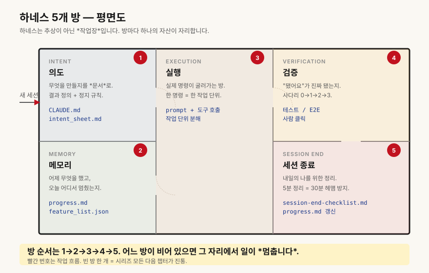

# 챕터 2. 하네스란, AI에게 일 시키는 작업장 차리기

> **"하네스는 모델을 더 똑똑하게 만드는 도구가 아닙니다. AI가 일할 수 있는 작업장입니다."**

## 미슐랭 셰프에게 가스레인지가 없었습니다

며칠 전, 한 후배 빌더에게 이런 메시지를 받았습니다.

> "형, Claude Pro도 결제했고, Cursor도 깔았고, 프롬프트 가이드도 다섯 권 읽었어요. 그런데 왜 결과물이 매번 갈아엎는 수준일까요?"

저는 답장 대신 질문 하나를 던졌습니다. *"프로젝트 폴더 안에 AI가 읽을 수 있는 문서가 한 장이라도 있어요?"* 한참 뒤에 돌아온 답은 "…없어요"였습니다.

문제는 모델도 아니고 IDE도 아니었습니다. **AI가 들어와서 일할 작업장 자체가 없었던 것**입니다.

## 재료만 잔뜩 사 둔 빈 주방

상상해 봅시다. 미슐랭 셰프(미쉐린 가이드 등재 셰프)를 모셔 왔습니다. 식재료도 최상급으로 준비했습니다.

그런데 주방에 가 보니, 가스레인지가 없습니다. 칼도 없고요. 레시피북도, 플레이팅 가이드도, 주문 들어오는 창구도 없습니다. 셰프는 한참 서 있다가 "오늘은 뭘 해야 하나요?"라고 묻습니다.

지금 우리가 Claude나 Cursor에 시키는 일의 90퍼센트가 이 상태입니다. 똑똑한 두뇌만 데려다 놓고, *일할 환경*은 하나도 안 만들어 줬습니다.

## 하네스 = AI가 일할 5개의 방

챕터 1에서 잠깐 보여드린 표를 다시 펼치겠습니다. 하네스(harness)는 다섯 개의 작은 시스템이 합쳐진 *작업장*입니다.

| 방 이름 | 역할 | 비유 |
|---|---|---|
| 의도(Intent) | "무엇을, 왜" 알려줌 | 셰프에게 건네는 오늘의 메뉴판 |
| 메모리(Memory) | 어제 한 일을 기억함 | 주방 칠판에 적힌 어제 재고 |
| 실행(Execution) | 실제로 칼을 잡고 불을 켬 | 가스레인지·도마·팬 |
| 검증(Verification) | "다 됐어요"가 진짜인지 확인 | 손님에게 내기 전 시식 |
| 세션(Session) | 길게 끊지 않고 잇기 | 점심 영업과 저녁 영업의 인수인계 |

<!-- DIAGRAM v1.1
  위치: ch02-set-up-the-workshop.md:35
  제목: "하네스 5개 방 — 평면도"
  설명: 의도/메모리/실행/검증/세션종료 5개 방의 위치 관계
  형식: 평면도(floor plan) 일러스트
  대체텍스트: 의도·메모리·실행·검증·세션 5개의 방이 작업장 평면도로 배치된 일러스트
-->

모델은 셰프의 *손과 머리*일 뿐입니다. 나머지 다섯 개는 우리가 차려줘야 합니다.

## 이런 사건, 또 익숙하지 않으신가요

**사건 1.** 노션에 제품 스펙을 정성껏 적어둔 박 PM님. 새 세션을 열고 "어제 정한 결제 흐름대로 작업 이어가줘"라고 했더니, AI는 "어제의 결정이 무엇인지 모르겠습니다"라고 답했습니다. 노션은 AI 폴더 바깥에 있었습니다.

**사건 2.** Lovable로 만든 SaaS의 가격 페이지를 고치던 이 빌더님. "어제 막혔던 Stripe 웹훅 그대로 가자"라고 했는데, AI가 또 처음부터 키를 새로 발급받고 코드를 갈아엎었습니다. 어제 막힌 지점이 *어디에도* 기록돼 있지 않았습니다.

**사건 3.** 매주 블로그를 쓰는 마케터 김 대표님. 톤 가이드를 매번 채팅창에 다시 붙여넣고 있었습니다. 어느 날 깜빡하고 빼먹은 뒤, AI는 갑자기 회사 톤과 정반대의 글을 한 편 뱉어냈습니다.

세 사건 모두 모델 잘못이 아닙니다. **작업장에 칠판이 없거나, 칼이 없거나, 시식 절차가 없었을 뿐**입니다.

## 하네스를 한 줄로 풀면

> 하네스는 *모델 가중치(weights) 바깥의 모든 작동 환경*입니다. 지시문, 메모리, 도구, 검증, 세션 관리를 모두 포함합니다.

저는 PM 동료들에게 이렇게 말합니다. *"모델은 직원, 하네스는 사무실이에요."* 아무리 똑똑한 직원도 책상·노트북·업무 매뉴얼·결재 라인 없이는 일 못 합니다. AI도 똑같습니다.

*(Ch00a에서 본 인턴 비유의 공간 버전입니다. 사람과 달리 AI는 매 세션 새 공간이 필요합니다.)*

흥미로운 건, 작업장을 차리는 데 코딩이 거의 필요 없다는 점입니다. 필요한 건 *문서 다섯 장*과 *폴더 하나*면 충분합니다.

## 비개발자가 작업장을 차린다는 것

거창하지 않습니다. 시작은 딱 다섯 가지입니다.

1. **프로젝트 폴더 하나** — 데스크탑에 `my-project/` 같은 폴더를 만듭니다. 노션이나 드라이브 말고, 로컬 폴더입니다.
2. **CLAUDE.md 한 장** — 이 프로젝트가 무엇을 하는지, 절대 하지 말 것은 무엇인지 적는 *작업장 안내문*입니다.
3. **feature_list.json** — 만들 기능 목록과 현재 상태(`passing`, `failing`, `blocked`)를 적는 *주문서*입니다.
4. **progress.md** — 매일 세션 끝에 5분만 적는 *주방 칠판*입니다.
5. **세션 종료 체크리스트 다섯 줄** — "오늘 한 일 / 막힌 곳 / 내일 첫 작업 / 사람 결정 필요 / 다음 세션 첫 명령" 다섯 줄이면 끝입니다.

이 다섯 가지가 챕터 4부터 챕터 12까지 한 칸씩 채워질 작업장의 *뼈대*입니다. 오늘은 폴더와 빈 파일만 만들어도 절반은 한 셈입니다.

## 오늘의 5분 액션

지금 노트북 앞이라면, 딱 5분만 써주세요.

1. 데스크탑에 `my-ai-workshop/` 폴더를 하나 만듭니다.
2. 그 안에 빈 파일 세 개를 만듭니다 — `CLAUDE.md`, `progress.md`, `feature_list.json`.
3. `CLAUDE.md` 첫 줄에 *"이 프로젝트는 ○○를 합니다"* 한 문장만 적습니다.
4. `progress.md` 첫 줄에 오늘 날짜를 적습니다.
5. `feature_list.json`은 빈 `[]` 한 줄로 둡니다.
6. 폴더를 Cursor 또는 Claude Code로 한 번 열어 봅니다.
7. 끝. 작업장 칸이 한 칸 생겼습니다.

내용은 비어 있어도 됩니다. *그릇이 먼저, 내용은 나중*입니다.

## 자가 점검 5문항

- [ ] AI에게 시킬 작업이 모이는 *고정된 폴더*가 한 곳에 있다.
- [ ] AI가 우리 프로젝트의 규칙을 읽을 수 있는 *한 장의 문서*가 있다.
- [ ] 어제 막힌 지점을 적어둔 파일이 있다.
- [ ] 만들 기능 목록과 현재 상태가 한 파일에 정리되어 있다.
- [ ] 세션을 닫기 전, 5분 동안 정리하는 *고정 루틴*이 있다.

세 개 이상 비어 있다면, 우리 작업장은 아직 빈 주방입니다. 같이 채워 갑니다.

## 마무리, 그리고 다음 챕터

작업장을 차린다는 건 거창한 인프라가 아닙니다. **폴더 하나, 문서 다섯 장, 매일 5분의 루틴**입니다.

> **하네스는 모델을 똑똑하게 만드는 도구가 아닙니다. AI가 일할 수 있는 작업장입니다.**

그런데 의문이 하나 남습니다. 왜 굳이 *폴더*여야 할까요? 노션, 슬랙, 채팅창에 적어두면 안 될까요?

다음 챕터 03에서는 **"채팅창 말고 폴더가 기억하게 하라"** — 왜 작업장이 반드시 *파일 시스템* 위에 서야 하는지, 그 한 가지 이유부터 풀어드리겠습니다.
