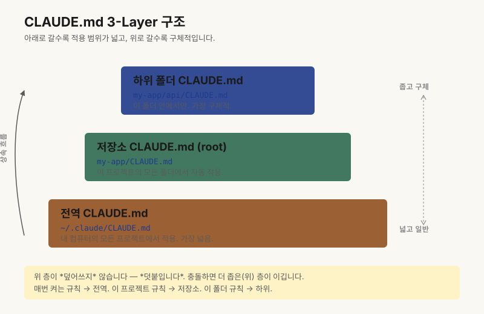

# 챕터 4. CLAUDE.md 한 장으로 AI에게 우리 프로젝트 가르치기

> **"채팅창에 쓴 지시는 사라집니다. 그런데 `CLAUDE.md`는, 모든 세션의 첫 페이지가 됩니다."**

## 같은 지시를 13번째 적던 날

지난주 화요일, 저는 Claude Code 새 창을 열고 또 이렇게 적고 있었습니다.

*"우리 프로젝트는 Lovable로 만든 SaaS고, 결제는 Stripe 테스트 모드만 써. main 브랜치엔 절대 푸시하지 마. 그리고 Lovable이 만든 파일은 한 번에 한 화면씩만 고쳐."*

13번째였습니다. 같은 문장, 다른 창. 어제도, 그저께도 적었던 그 지시를 저는 또 손으로 옮기고 있었던 겁니다.

문제는 명확했습니다. AI가 까먹는 게 아닙니다. **저는 AI가 매번 펴볼 수 있는 한 장의 노트를 안 만들어 줬을 뿐입니다.**

> **CLAUDE.md는 우리 프로젝트의 시스템 오브 레코드(System of Record)입니다. 채팅창에 쓴 지시는 사라지지만, 이 파일은 모든 세션의 시작점이 됩니다.**

## "AI가 어제 한 대화를 잊었어요"의 본질

비개발자 빌더에게 가장 많이 듣는 말입니다. *"어제는 알아듣더니, 오늘은 처음 보는 사람처럼 굴어요."*

당연합니다. 채팅창은 휘발성 메모리입니다. 새 세션이 열리는 순간 어제의 맥락은 0이 됩니다. 모델이 똑똑한 것과, *우리 프로젝트의 규칙을 안다는 것*은 완전히 다른 문제입니다.

그래서 우리는 매번 같은 설명을 반복합니다. "스택은 이거고, 폴더 구조는 저렇고, 절대 하지 말 건 이런 것들이고..." 그러다 지쳐서 그냥 "알아서 해줘"라고 던집니다. 그 순간 AI는 자기가 아는 *세상의 평균값*으로 답합니다. 우리 프로젝트가 아니라.

## CLAUDE.md, 우리 프로젝트의 첫 페이지

`CLAUDE.md`는 Anthropic이 정한 컨벤션입니다. (오픈 표준인 `AGENTS.md`와 거의 호환됩니다.) 폴더 루트에 이 파일이 있으면, Claude Code는 세션을 시작할 때 **가장 먼저 이 파일을 펴봅니다**.

비개발자 언어로 옮기면 이렇습니다.

> **AI가 출근하면 가장 먼저 펴보는 노트.** 우리 프로젝트의 한 줄 정의, 쓰는 도구, 절대 하지 말 것, 자주 하는 작업의 검증 방법까지. 매번 입으로 설명하던 것을 *글로 한 번 적어두면 끝*입니다.

채팅창 = 휘발성, `CLAUDE.md` = 자산. 챕터 3에서 *"폴더가 기억하게 하라"*고 했던 그 폴더의 첫 페이지가 바로 이 파일입니다.

## CLAUDE.md에 꼭 들어가는 8개 칸

| # | 칸 이름 | 이게 왜 중요한가 |
|---|---|---|
| 1 | 프로젝트 한 줄 정의 | AI가 우리가 뭘 만드는지 한 문장으로 안다 |
| 2 | 사용 도구 스택 | "어떤 라이브러리를 쓰지?"를 묻지 않게 한다 |
| 3 | 절대 하지 말 것 (하드 제약 5~10개) | 사고를 미리 차단한다. main 푸시 금지, 라이브 키 금지 같은 것 |
| 4 | 자주 하는 작업 + 검증 방법 | "다 됐어요"가 아니라 *어떻게 됐다고 말할지*를 정한다 |
| 5 | 폴더/파일 컨벤션 | 파일이 엉뚱한 곳에 쌓이는 걸 막는다 |
| 6 | 세션 시작 시 항상 확인할 것 | 어제 막힌 자리에서 오늘 이어가게 한다 |
| 7 | 세션 종료 시 항상 남길 것 | 내일의 나에게 메모를 남긴다 (챕터 5 연결) |
| 8 | 사람의 승인이 필요한 작업 | 휴먼 인 더 루프. 외부 발송, 라이브 모드 같은 것 |

미니 예시는 이렇게 생겼습니다.

```markdown
## 3. 절대 하지 말 것 (하드 제약)
- main 브랜치에 직접 푸시 금지. 항상 브랜치를 따고 PR을 만듭니다.
- Stripe 라이브 키를 코드에 적지 마세요. 환경변수만 사용합니다.
- 실서비스 DB 테이블에 DROP, TRUNCATE를 실행하지 마세요.
```

8칸을 다 채우려고 애쓰지 마세요. **5칸이면 출발선으로 충분**합니다.

## 3개 변형: PM / 1인 빌더 / 마케터

운영자가 직접 쓰는 3개 변형을 짧게 발췌합니다. 전체는 루틴팩에서 통째로 받으실 수 있습니다.

**변형 A — PM 버전.** *"회의록 원본 파일을 직접 수정하지 마세요. 항상 사본을 만든 후 작업합니다. 외부 고객사명, 매출 수치는 요약본에 그대로 노출하지 마세요. 마스킹 후 게시합니다."* — 스펙 문서와 회의록 자동 요약을 다루는 PM의 하드 제약입니다.

**변형 B — 1인 빌더 버전.** *"Lovable이 생성한 파일을 일괄 리팩토링하지 마세요. 변경 범위는 한 번에 한 화면만. main 브랜치에 직접 푸시 금지. Stripe 라이브 키를 코드에 적지 마세요."* — Lovable + Supabase + Stripe 조합에서 가장 자주 터지는 사고를 미리 막습니다.

**변형 C — 마케터 버전.** *"사람 검토 없이 SNS, 뉴스레터에 자동 발행 금지. 같은 글을 SNS 채널에 동일 문장으로 복붙 금지. 채널별 톤을 분리합니다."* — 블로그/SNS/뉴스레터 자동 발행 루틴에서 브랜드 사고를 막는 라인입니다.

> 이 챕터의 부록으로 **루틴팩 v1**(`CLAUDE.md` 3종 변형 / `feature_list.json` / `progress.md` / `intent_sheet.md` / 세션 종료 체크리스트)을 무료로 다운로드하실 수 있습니다. 본인 페르소나 한 줄에 맞춰 한 가지만 골라 쓰시면 됩니다.

## 한 프로젝트에 CLAUDE.md는 한 개가 아닙니다 — 3-Layer 구조

`CLAUDE.md`는 사실 한 장이 아닙니다. *로딩되는 위치*에 따라 세 개의 층이 있고, Claude Code는 하위 폴더에서 세션을 시작하면 위로 거슬러 올라가며 각 층의 `CLAUDE.md`를 모두 읽어 합칩니다. 그래서 *공통 규칙은 위에, 세부 규칙은 아래에* 두는 것이 핵심입니다.

| 레이어 | 위치 | 무엇이 들어가는가 | 한 줄 예시 |
|---|---|---|---|
| 전역 (Global) | `~/.claude/CLAUDE.md` | 내 모든 프로젝트에 공통 적용되는 *개인 취향·작업 규칙* | "응답은 항상 한국어로. 코드 블록엔 언어 태그를 붙인다." |
| 저장소 (Repo) | 프로젝트 루트의 `CLAUDE.md` | 이 프로젝트 전체에 적용되는 *팀·프로젝트 규칙* | "Lovable + Supabase 스택. main 푸시 금지." |
| 프로젝트 단위 (Sub-project) | 하위 폴더의 `CLAUDE.md` | 이 폴더에서만 적용되는 *세부 컨벤션* | "/db 폴더 안에서는 마이그레이션 파일에 반드시 롤백 SQL을 같이 작성한다." |

<!-- DIAGRAM v1.1
  위치: ch04-claude-md-one-page.md:82
  제목: "CLAUDE.md 3-Layer 구조 — 수직 단면도"
  설명: 전역(~/.claude/) → 저장소(root) → 하위 폴더의 위치 계층
  형식: 수직 단면도(vertical section)
  대체텍스트: 전역 레이어(~/.claude/)가 위, 저장소 루트가 중간, 하위 폴더가 아래에 위치한 3단 수직 단면도
-->


비개발자가 *지금 당장* 만들 수 있는 최소 구성은 단순합니다. **저장소 루트에 한 장만 시작하세요. 익숙해지면 전역으로 한 칸 더, 그 다음에 하위 폴더로 한 칸 더.** 처음부터 3층을 다 쌓으려고 하면 어떤 규칙이 어디에 있는지 본인도 잊습니다.

## CLAUDE.md를 망치는 5가지 실수

- **600줄까지 부풀린다.** 길수록 좋은 게 아닙니다. 긴 문서일수록 모델이 중간을 흘려 읽습니다(Lost in the middle). 50~150줄을 마지노선으로 잡으세요.
- **문맥세를 무시한다.** Yan의 표현을 빌리면, 부풀려진 CLAUDE.md는 *context tax(문맥세)* — 세션이 시작할 때마다 내는 세금입니다. 안 쓰는 정보까지 매번 다 읽혀서, 정작 필요한 토큰 예산이 줄어든다는 뜻입니다.
- **자주 안 쓰는 정보까지 다 박는다.** 분기에 한 번 쓰는 규칙은 별도 문서로 빼세요. `CLAUDE.md`는 *매일 쓰는 것만* 들어갑니다.
- **하드 제약과 권장사항을 섞는다.** "절대 하지 말 것"과 "되도록 이렇게 해주세요"는 분리하세요. 섞이면 둘 다 안 지킵니다.
- **한 번 만들고 업데이트 안 한다.** 새 사건이 터질 때마다 한 줄씩 추가하는 살아있는 문서입니다. 사고가 났다면 그건 *새 제약이 필요하다는 신호*입니다.
- **채팅창에 쓴 지시를 옮기지 않는다.** 어제 채팅창에 또 적었다면, 오늘 그 한 줄은 `CLAUDE.md`로 올라가야 합니다. 그게 13번째 반복을 막는 유일한 방법입니다.

### Karpathy의 4원칙: 검증된 에이전트 행동 가이드

Andrej Karpathy(전 Tesla AI 총괄, OpenAI 공동창업자)가 정리한 실제 CLAUDE.md 행동 원칙입니다. 비개발자도 이 4개만 알면 AI 에이전트의 작동 방식이 달라집니다.

| 원칙 | 한 줄 요약 | habix 시리즈 연결 |
|---|---|---|
| Think Before Coding | 가정 말고 질문 | intent_sheet.md의 "정지 규칙" |
| Simplicity First | 요청한 것만 | Ch07 "과욕 막기" |
| Surgical Changes | 필요한 것만 건드리기 | 작업 단위 분해 |
| Goal-Driven Execution | 성공 기준 먼저 | 검증 사다리 (Ch09) |

이 원칙들은 `CLAUDE.md`의 **"작업 방식 (How to work)"** 섹션에 그대로 붙여 쓸 수 있습니다.

## 분리 시점: CLAUDE.md를 쪼개야 할 때

50~200줄을 넘기기 시작하면, 그 자체로 신호입니다. **주제별 서브 문서로 분리**할 때입니다.

예시. 인증 규칙이 길어지면 `docs/auth.md`로, 결제 규칙은 `docs/payment.md`로, AI 에이전트 톤 가이드는 `docs/ai-rules.md`로 빼냅니다. `CLAUDE.md`에는 *"인증 관련 규칙은 docs/auth.md를 먼저 읽으세요"* 한 줄만 남기면 됩니다.

`CLAUDE.md`는 색인(index)이지 사전(dictionary)이 아닙니다.

## 오늘의 5분 액션

이 글을 닫기 전에, 5분만 손을 움직여 보세요.

1. 프로젝트 폴더 루트에 `CLAUDE.md` 파일을 새로 만듭니다.
2. 위 8칸 중 **(1) 한 줄 정의, (2) 도구 스택, (3) 절대 하지 말 것, (6) 세션 시작 시 확인할 것, (8) 사람 승인 필요한 작업** — 이 5칸만 채웁니다.
3. 그중 (3) "절대 하지 말 것"에는 최근 1주일 안에 *AI가 실제로 사고 친 사례*를 거꾸로 적습니다. ("main에 푸시함" → "main 푸시 금지")
4. 저장하고, Claude Code 새 창을 열어 *"`CLAUDE.md`를 먼저 읽고 시작해줘"*라고 한 줄 적어봅니다.
5. 본인 페르소나에 맞는 전체 템플릿이 필요하시다면, **루틴팩 v1**을 받으시면 됩니다. PM/1인 빌더/마케터 3종 변형이 그대로 들어 있습니다.

> 루틴팩 v1 = `CLAUDE.md` 3종 변형 + `feature_list.json` + `progress.md` + `intent_sheet.md` + 세션 종료 체크리스트. 한 줄 이메일이면 받습니다.

## 자가 점검 5문항

- [ ] 우리 프로젝트의 *절대 하지 말 것*을 한 곳에 적어두었나요?
- [ ] 새 세션을 시작할 때 AI에게 매번 같은 설명을 반복하나요?
- [ ] *"다 됐어요"*를 받기 전, AI가 어떻게 검증해야 하는지 글로 정해두었나요?
- [ ] 사람의 승인이 필요한 작업이 어디까지인지 명시되어 있나요?
- [ ] `CLAUDE.md`가 지난 한 달 안에 한 번이라도 업데이트됐나요?

세 개 이상 *아니오*라면, 오늘 5분 액션이 정확히 당신을 위한 과제입니다.

## 마무리, 그리고 다음 챕터

다시 한번.

> **채팅창에 쓴 지시는 사라집니다. `CLAUDE.md`는, 모든 세션의 첫 페이지가 됩니다.**

`CLAUDE.md`가 *프로젝트의 첫 페이지*라면, 다음 챕터는 *어제와 오늘을 잇는 페이지*입니다. **챕터 05 — AI는 어제 한 일을 잊는다, 메모를 남겨라.** `progress.md` 한 장으로 세션 간 기억을 이어 붙이는 법을 같이 만들어 보겠습니다.

---

**참고**
- Eugene Yan, "How to Work and Compound with AI", eugeneyan.com/writing/working-with-ai/
