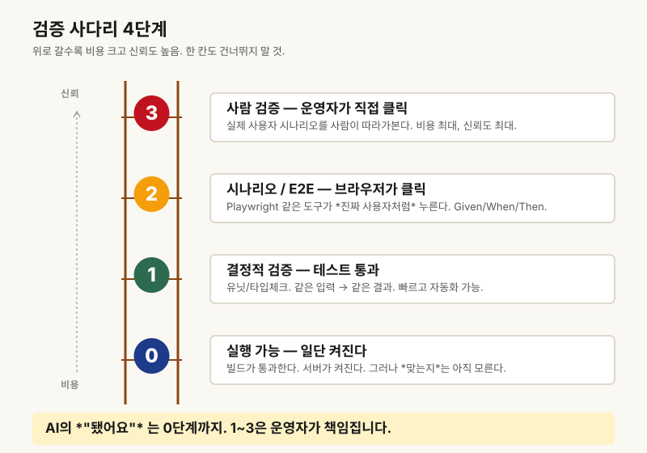

# 챕터 9. '됐어요'를 믿지 마라, 증거를 요구하라

> ***"You can't delegate what you can't verify."*** — Eugene Yan, "How to Work and Compound with AI"

## 친구 앞에서 첫 클릭에 무너진 밤

지난달 금요일 밤, 저는 친구를 불러 앉혀 놓고 노트북을 돌렸습니다. 한 주 내내 Claude Code와 씨름해 만든 구독 결제 흐름이었습니다. AI는 분명히 이렇게 답했습니다. *"모든 기능을 구현하고 테스트까지 마쳤습니다. 완료했습니다."*

친구가 첫 결제 버튼을 눌렀습니다. 화면이 흰색으로 멈췄습니다. 새로고침을 했더니, 결제는 이미 처리되어 있었습니다. 그런데 영수증 이메일은 오지 않았습니다. 어디까지 동작하고 어디서 깨졌는지, 저조차 모르고 있었습니다.

그날 밤 저는 한 줄을 적었습니다. **"AI의 '됐어요'를 믿지 말고, 증거를 요구하자."**

## 문제 정의 — 조기 완료 선언(declaring victory too early)

AI가 "완료했습니다"라고 말할 때, 그 말은 정확히 무엇을 뜻할까요. 솔직히 말씀드리면, 대부분의 경우 그건 *"당신이 시킨 코드를 생성했습니다"*라는 뜻입니다. *"그 코드가 실제로 동작합니다"*가 아닙니다.

이 둘은 완전히 다른 사건입니다. 코드를 *생성한 것*과 코드가 *작동하는 것* 사이에는 최소한 네 개의 검증 계단이 있습니다. AI는 가장 아래 계단(코드가 컴파일됨)만 보고 "완료"를 선언하는 경우가 압도적으로 많습니다. 우리는 그 말을 받아 마지막 계단(사용자 시연)으로 곧장 점프하고, 그 사이 비어 있는 계단에서 매번 무너집니다.

조기 완료 선언은 모델의 거짓말이 아닙니다. *우리가 "완료(Done)"의 정의를 미리 안 적어 줬기 때문*입니다.

## 핵심 인사이트 — 위임 가능성 = 검증 가능성

Eugene Yan의 한 문장을 다시 봅시다.

> *"You can't delegate what you can't verify."*

검증할 수 없는 일은 위임이 아닙니다. *희망*입니다. 검증 명령(verification command)이 없는 위임은, 그냥 잘되기를 비는 행위입니다.

그리고 검증은 단일한 한 번의 행위가 아닙니다. **사다리**입니다. 아래 칸은 싸고 결정적입니다(린트 통과, 테스트 그린, HTTP 200 응답). 위 칸은 비싸지만 판단이 필요합니다(실제 사용자 시연, 디자인 리뷰, 매출에 미치는 영향). 좋은 빌더는 *아래 칸을 자동화*하고 *위 칸에 사람의 시간을 아낍니다*. 나쁜 빌더는 두 칸을 다 사람이 매번 손으로 하다가 지쳐 결국 "그냥 됐다고 하니까 됐겠지"로 떨어집니다.

위임 가능성은 곧 검증 가능성입니다. 한 줄짜리 검증 명령이 없는 기능은, 끝낼 수 없는 기능입니다.

## 비개발자 사례 3개

**사례 1 — Lovable의 "버튼 추가 완료".** 박 대표님은 Lovable에 "장바구니 버튼을 헤더에 추가해줘"라고 시켰습니다. AI는 "완료했습니다"라고 답했고, 데스크톱에서는 멀쩡히 보였습니다. 그런데 모바일에서 열어보니 헤더가 좁아 버튼이 화면 밖으로 밀려 있었습니다. AI는 한 번도 모바일 폭으로 자기 결과를 본 적이 없었습니다.

**사례 2 — Cursor의 "테스트 통과".** 이 빌더님은 Cursor가 "모든 테스트가 통과했습니다"라고 답해 안심하고 배포했습니다. 프로덕션에서 첫 사용자가 로그인하자마자 깨졌습니다. 원인은 `.env` 파일의 키 하나. 로컬에는 있고 프로덕션엔 없는 환경변수였습니다. 테스트는 *로컬에서*만 통과했던 겁니다.

**사례 3 — Claude Code의 "결제 흐름 구현 완료".** 운영자(저)의 사례입니다. 결제는 성공했고, DB에 active 행도 생겼습니다. 그런데 영수증 이메일은 오지 않았습니다. AI는 "구현 완료"라고 했지만, 발신 도메인 인증이 빠져 메일이 스팸함으로 빠지는 건 검증 범위 밖이었습니다. 끝나야 끝난 게 아니었습니다.

## 검증의 4단계 사다리 (비개발자용)

| 단계 | 무엇을 보는가 | 언제 쓰는가 | 누가 한 줄로 | 우리 도구 |
|---|---|---|---|---|
| 0단계 — 실행 | 앱이 켜지는가, 페이지가 열리는가 | 코드를 한 줄이라도 바꿨을 때 매번 | "흰 화면이 아니라 뭐라도 보이는가" | 브라우저 새로고침, `npm run dev` |
| 1단계 — 결정적 검증 | 린트, 타입 체크, 자동 테스트 통과 | 기능 한 개를 마쳤다고 선언하기 직전 | "기계가 봐도 통과하는가" | `npm test`, `tsc --noEmit`, `eslint` |
| 2단계 — 시나리오 검증 | 진짜 사용자처럼 끝까지 클릭 | 결제·가입·메일 같은 *끝-사건*이 있는 흐름 | "진짜 흐름이 끝나는가" | Playwright, Stripe 테스트 카드, E2E 스크립트 |
| 3단계 — 사람 검증 | 디자인·톤·매출 영향 | 외부 발송, 라이브 모드, 사용자 노출 직전 | "실제 사람이 좋다고 하는가" | `intent_sheet.md`의 휴먼 체크포인트 |

<!-- DIAGRAM v1.1
  위치: ch09-no-victory-without-evidence.md:50
  제목: "검증 사다리 4단계"
  설명: 0단계(실행가능) → 1단계(결정적) → 2단계(E2E) → 3단계(사람 검증)
  형식: 사다리(ladder) 일러스트
  대체텍스트: 아래에서 위로 0단계 실행가능·1단계 결정적 검증·2단계 E2E·3단계 사람 검증 순서로 올라가는 4칸 사다리 일러스트
-->


핵심 원칙은 이겁니다. **0~2단계는 기계가 매번, 3단계는 사람이 결정적 순간에.** 사람이 0단계까지 매번 손으로 하는 건 시간 낭비고, 기계가 3단계까지 결정하는 건 사고의 시작입니다.

## "됐어요"를 무력화하는 3가지 규칙

- **규칙 1 — 모든 기능에 검증 명령을 *기능을 시키기 전에* 적어두기.** "이 기능은 어떻게 됐다고 말할지"를 미리 한 줄로 정합니다. `feature_list.json`의 `verification` 칸이 비어 있는 기능은, *아직 시작할 수 없는 기능*입니다.

- **규칙 2 — 검증이 통과해야만 state를 `passing`으로 바꾸기.** `feature_list.json`의 state는 5가지(`todo`, `active`, `passing`, `failing`, `blocked`) 중 하나입니다. AI가 "완료"라고 말해도, `verification` 명령이 실제로 통과해야 *그제서야* `passing`으로 올라갑니다. 말이 아니라 명령이 state를 바꿉니다.

```json
{
  "id": "F-003",
  "behavior": "결제 성공 시 사용자에게 영수증 이메일이 발송됩니다.",
  "verification": "테스트 결제 후 메일함에서 영수증 도착 여부와 금액 표기를 확인합니다.",
  "state": "failing",
  "notes": "발신 도메인 인증 미완료로 스팸함 분류. DNS 설정 필요."
}
```

- **규칙 3 — 사람이 봐야 끝나는 항목은 `intent_sheet.md`의 휴먼 체크포인트에 박기.** 외부 발송, 라이브 모드 전환, 사용자 노출은 기계가 "통과"라고 해도 *사람의 OK*가 있어야 끝납니다. 이 항목은 의도 시트 6번 칸(휴먼 체크포인트)에 미리 적어 둡니다.

## 오늘의 5분 액션

1. 최근 1주일 안에 AI가 "완료했다"고 답한 작업 1개를 고릅니다.
2. 그 작업의 *검증 명령 한 줄*을 사후라도 적어봅니다. 한 줄이 안 나오면, 그 작업은 *아직 완료된 게 아닙니다*.
3. `feature_list.json`을 열고, 앞으로 할 작업 3개의 `verification` 칸을 *시키기 전에* 채워둡니다.
4. 그중 사람이 봐야 끝나는 항목 1개를 골라, `intent_sheet.md`의 6번 "휴먼 체크포인트"에 한 줄로 박습니다.
5. 새 Claude Code 창을 열고 이렇게 적어봅니다. *"feature_list.json의 verification이 통과하지 않으면 state를 passing으로 바꾸지 마."*

## 자가 점검 5문항

- [ ] 우리 프로젝트의 "완료(Done)" 정의를 한 줄로 적을 수 있나요?
- [ ] AI가 "다 됐다"고 했을 때, 그게 사실인지 확인할 *검증 명령*이 미리 있나요?
- [ ] `feature_list.json`의 `verification` 칸이 비어 있는 기능이 절반 이상인가요?
- [ ] 마지막 시연에서 첫 클릭에 깨진 경험이 있나요?
- [ ] 사람이 봐야 끝나는 작업과 기계가 봐서 끝나는 작업을 구분해 두었나요?

세 개 이상 *아니오*거나 *그렇다*라면, 오늘 5분 액션이 정확히 당신을 위한 과제입니다.

## 마무리, 그리고 다음 챕터

다시 한번.

> ***위임할 수 없는 건, 검증할 수 없는 것입니다.*** AI의 "됐어요"는 시작 신호일 뿐, 종료 신호가 아닙니다. 종료는 *검증 명령*이 결정합니다.

다음 챕터는 사다리의 한 칸을 더 올라갑니다. **챕터 10 — 실제 사용자처럼 클릭해보는 자동 테스트.** 2단계 시나리오 검증을 비개발자도 쓸 수 있게 한 장으로 만들어 보겠습니다. 검증이 사다리라면, 챕터 10은 그 사다리의 한 칸을 더 올라갑니다.

---

**참고**
- Eugene Yan, "How to Work and Compound with AI", eugeneyan.com/writing/working-with-ai/
- 원본 강의: walkinglabs.github.io/learn-harness-engineering/ko/ 강의 09
