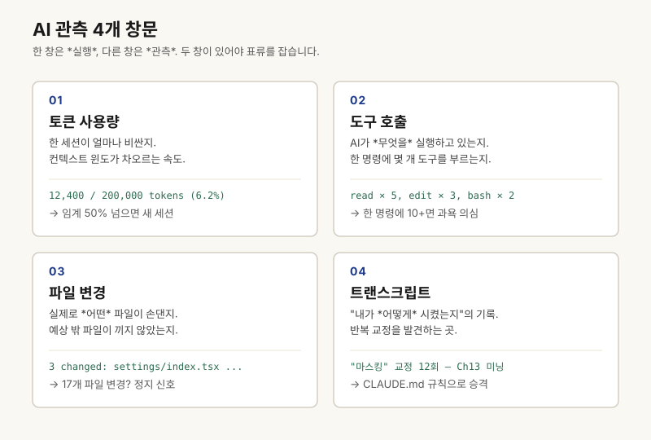

# 챕터 11. AI가 뭘 했는지 들여다보는 창문

> **"AI가 *무엇을 했는지* 보지 못하면, 청구서로만 알게 됩니다. 관측 가능성(Observability)은 *하네스 안*에 있어야 합니다."**

## 청구서 $47, 그제서야 한 주를 알게 된 밤

한 주가 끝난 일요일 밤, Anthropic 콘솔을 무심코 열었습니다. **$47.** 평소의 세 배였습니다.

저는 한참을 멍하니 화면을 봤습니다. AI가 그 주 무엇을 그렇게 많이 했길래 $47이 찍혔는지, 저는 *그 청구서가 알려주기 전까지 몰랐습니다.* 채팅창은 이미 닫혀 있었고, 어떤 도구를 몇 번 불렀는지, 어떤 파일을 몇 번이나 다시 썼는지, 흔적은 어디에도 없었습니다.

그날 밤 저는 이 한 줄을 적었습니다.

> **AI가 무엇을 했는지 보지 못하면, 우리는 청구서로만 알게 됩니다.**

## 문제 정의 — AI는 기본값으로 *블랙박스 동료*입니다

AI는 우리 옆에 앉은 동료인데, 책상이 *완전히 가려져* 있습니다. 도구를 몇 번 호출했는지, 어떤 파일을 몇 번 읽었는지, 토큰을 어디에 썼는지, 기본값으로는 *아무것도 보이지 않습니다*.

보이지 않으면, 고칠 수 없습니다. 같은 도구를 50번 헛돌고 있어도, 같은 파일을 4번 다시 쓰고 있어도, 우리는 *주말에 청구서를 열고서야* 알게 됩니다.

청구서 충격, 실패한 시연, "왜 이렇게 느려요?" 라는 사용자의 메시지 — 이 세 가지는 모두 *증상*입니다. 진짜 병명은 한 가지, **관측 부재(no observability)**입니다.

## 핵심 인사이트 — 비개발자가 알아야 할 4개의 창문

AI를 관측한다는 건 거창한 모니터링 시스템을 까는 게 아닙니다. **이미 존재하는 4개의 창문**을 *제때 여는 습관*입니다.

1. **토큰 사용 로그.** Anthropic 콘솔의 Usage 페이지, OpenAI 사용량 대시보드, Cursor/Claude Code 안에 박혀 있는 토큰 카운터. *"오늘 얼마나 썼나"*를 한 숫자로 알려주는 가장 싼 창문입니다.
2. **도구 호출 추적.** AI가 어떤 외부 도구·MCP를 *언제·왜* 호출했는지. Claude Code의 tool use 로그, Cursor의 trace 패널, MCP 서버 자체의 로그.
3. **파일 변경 로그.** `git diff` 한 줄로 *어떤 파일이 얼마나 변했는지*. AI가 손대지 말아야 할 곳을 만졌다면 여기서 가장 먼저 잡힙니다.
4. **세션 트랜스크립트.** 모든 메시지의 *원본 텍스트*. 채팅창을 거꾸로 읽는 것 자체가 관측입니다.

> *"Long sessions drift. Put a second window on the first to watch it work."* — Eugene Yan
>
> 한국어로 풀면: *긴 세션은 표류합니다. 두 번째 창을 띄워 첫 번째를 지켜보세요.*

네 개의 창문 중 *한 개라도 매일 열면*, 청구서는 더 이상 통보가 아니라 *예상 가능한 숫자*가 됩니다.

## 비개발자 사례 3개

**사례 1 — Claude Code의 30분 무한 루프.** 1인 빌더 김 대표님은 외출 30분 후 돌아와 화면을 보고도 작업이 잘 되는 줄 알았습니다. 트랜스크립트를 *거꾸로* 읽고서야, AI가 같은 테스트를 47번 다시 돌리며 같은 에러 메시지를 출력하고 있었다는 걸 알아챘습니다. 토큰 카운터 하나만 켜뒀어도 10분 안에 잡혔을 사건입니다.

**사례 2 — PM의 회의록 이중 요약 사고.** 박 PM님은 MCP를 잘못 연결해 회의록 요약 도구가 *매번 두 번 실행*되도록 만들었습니다. 한 주 청구서가 두 배로 뛰고서야 알았습니다. 도구 호출 추적 패널을 *세션 끝에 한 번만* 봤어도 5분 후에 인지했을 사고입니다.

**사례 3 — 마케터의 같은 글 4번 재작성.** 이 마케터님은 한 편의 블로그 글을 AI에게 맡겼는데, AI가 *같은 본문을 네 번 새로 쓴* 사실을 청구서를 보고서야 알았습니다. `git diff`를 매일 한 번 열었다면, 변경 파일 한 개가 4배로 부풀고 있는 걸 그날 봤을 겁니다.

## 관측의 4가지 창문 — 한 표 정리

| 창문 | 보이는 것 | 어디서 보는가 | 위험 신호 |
|---|---|---|---|
| 토큰 사용 | 비용·세션 길이 | Anthropic 콘솔, OpenAI Usage, Cursor 카운터 | 어제의 2배 이상 급등 |
| 도구 호출 | 무엇을·언제·몇 번 | MCP 로그, Cursor trace, Claude Code 로그 | 같은 도구를 10회 이상 반복 |
| 파일 변경 | 어디가·얼마나 바뀌었나 | `git diff`, `git status` | 손대지 말아야 할 폴더가 바뀜 |
| 트랜스크립트 | 진짜 무슨 말이 오갔나 | 채팅 로그, 세션 export | 같은 교정 5회 이상 반복 |

<!-- DIAGRAM v1.1
  위치: ch11-window-into-ai.md:55
  제목: "AI 관측 4개 창문 — 격자"
  설명: 토큰 사용량 / 도구 호출 / 파일 변경 / 트랜스크립트 4칸
  형식: 격자(grid) 일러스트
  대체텍스트: 토큰 사용량·도구 호출·파일 변경·트랜스크립트 4개 창문이 2×2 격자로 배치된 일러스트
-->

## 관측을 *하네스 안*으로 들여놓는 3가지

관측이 따로 노는 도구가 아니라 *루틴 파일의 일부*가 되어야 진짜 작동합니다.

- **세션 종료 시 한 줄.** `progress.md` 맨 아래에 *오늘 토큰 사용량·도구 호출 횟수·변경 파일 수*를 한 줄로 남깁니다. 예: `토큰 12.4K / 도구 호출 18회 / 변경 파일 3개`. 30일이면 추세선이 보입니다.
- **정지 규칙으로 박기.** `intent_sheet.md`의 4번 정지 규칙에 *"토큰 N 초과 / 같은 도구 M회 / 변경 파일 K개"* 셋 중 하나라도 충족되면 멈추고 보고하도록 박습니다. 관측이 *행동을 바꿔야* 비로소 관측입니다.
- **매월 1일 트랜스크립트 마이닝.** 지난 30일치 채팅 로그를 통독하면서 *같은 교정을 5번 이상* 한 항목을 형광펜으로 표시합니다. 그 표시가 다음 달 `CLAUDE.md`의 새 규칙 후보입니다. (이 기법 자체는 챕터 13에서 본격적으로 다룹니다.)

## 오늘의 5분 액션

1. 지금 쓰는 도구의 *사용량 페이지*를 새 탭에서 열고, 어제 하루의 토큰 숫자를 적습니다.
2. 오늘 세션이 끝나기 직전, `progress.md` 맨 아래에 *토큰·도구 호출 수·변경 파일 수* 한 줄을 적습니다.
3. `intent_sheet.md`의 4번 정지 규칙에 *"토큰 30K 초과 시 정지하고 보고"* 한 줄을 박습니다.
4. `git status`를 세션 종료 직전 한 번 돌립니다. 이번 세션에서 *바뀌면 안 되는 폴더*가 바뀌었는지 눈으로 봅니다.
5. 4개의 창문 중 *오늘 한 번도 안 연 창문* 한 개를 골라, 내일 첫 세션 시작 시 열기로 결심합니다.

## 자가 점검 5문항

- [ ] 어제 AI가 *얼마의 토큰*을 썼는지 한 숫자로 답할 수 있나요?
- [ ] AI가 *어떤 도구를 몇 번 불렀는지* 마지막 세션에서 보셨나요?
- [ ] 지난 1주일 중 가장 비용이 큰 *세션 한 개*를 짚을 수 있나요?
- [ ] *같은 교정·같은 도구 호출이 반복되는 패턴*을 본 적 있나요?
- [ ] 청구서 외에 *AI의 활동을 보는 창문*이 몇 개나 있나요?

세 개 이상 *아니오*라면, 오늘 5분 액션이 정확히 당신을 위한 과제입니다.

## 마무리, 그리고 다음 챕터

다시 한번.

> **AI가 무엇을 했는지 보지 못하면, 우리는 청구서로만 알게 됩니다. 관측 가능성은 하네스 *바깥*이 아니라 *안*에 있어야 합니다.**

창문 4개를 열어두는 것까지가 오늘의 일입니다. 다음 챕터는 *창문을 닫고 책상을 정리하는 법*입니다. **챕터 12 — 내일의 나를 위해 책상 정리하고 나가기.** 창문이 있다면, 그 창문이 더러워지기 전에 *닦고 나가야* 합니다. 그래야 내일의 첫 세션이 *오늘이 멈춘 자리*에서 곧장 출발합니다.

---

**운영자 맥락**
- 이 챕터는 [progress.md](../routine-pack/progress.md)에 토큰 사용량, 도구 호출 수, 변경 파일 수를 남기는 운영 습관과 연결됩니다.
- backend agent로 확장할 때는 [Request Lifecycle](../../templates/request-lifecycle.md)의 persistence와 trace 항목으로 이어집니다.
- 외부 참고: [Eugene Yan, "How to Work and Compound with AI"](https://eugeneyan.com/writing/working-with-ai/).
